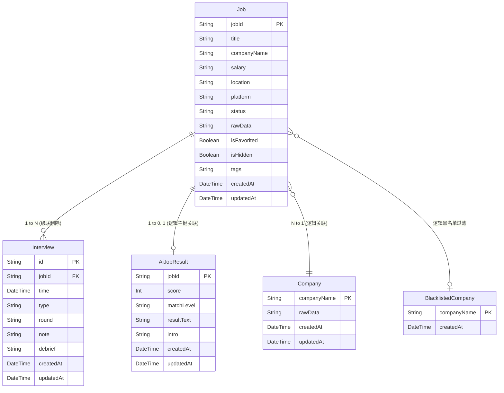

# 数据库设计文档 (Database Design Document)

## 1. 概述 (Overview)

**Job Dashboard Local** 采用轻量级的 **SQLite** 作为本地存储引擎，并利用 **Prisma ORM** 进行强类型管理与 Schema 建模。系统数据不依赖外部云端数据库，数据保存在项目根目录下的 `prisma/dev.db` 文件中。

数据库设计的核心原则为：
1. **原始数据不丢原则**：对于第三方不可控的异构结构（如不同平台的职位数据），通过 `rawData` 字段全量保存 JSON 字符串，为未来的字段解析和扩展提供退路。
2. **逻辑弱解耦**：AI 诊断结果 (`AiJobResult`) 等周边信息与 `Job` 表采用弱解耦策略设计（通过同名 `jobId` 关联，但不加级联硬外键），以便在清理过期职位时依然能保留高价值的诊断记录。

---

## 2. 实体关系图 (Entity-Relationship Diagram)

---

## 3. 数据字典 (Data Dictionary)

### 3.1 核心职位表 (`Job`)
记录用户通过插件或手动导入的职位招聘信息。

| 字段名 | 类型 | 约束 | 默认值 | 描述说明 |
| :--- | :--- | :--- | :--- | :--- |
| **jobId** | String | `PK` | - | 职位全局唯一标识 (通常为平台方 ID) |
| title | String | 必填 | - | 职位名称标题 |
| companyName | String | 必填 | - | 招聘方公司全称 |
| salary | String | 必填 | - | 薪资范围 (如 "15-30K") |
| location | String | 必填 | - | 所在城市或简单地点 |
| platform | String | 必填 | - | 来源平台 (如 Boss直聘, 51job, 猎聘等) |
| status | String | 必填 | `normal` | 看板状态枚举 (`normal`, `to-apply`, `applied`, `interview-1`, `offer` 等) |
| rawData | String | 必填 | - | 抓取到的海量原始 JSON 文本，由 Normalizer 在后端清洗 |
| isFavorited | Boolean| 必填 | `false` | 是否被收藏标星 ⭐ |
| isHidden | Boolean| 必填 | `false` | 是否手动标记为不合适/隐藏 👎 |
| tags | String | 可空 | `null` | 本地手动附加的标签数组 JSON |
| createdAt | DateTime | 必填 | `now()` | 数据入库时间 |
| updatedAt | DateTime | 必填 | `now()` | 记录更新时间 |

### 3.2 面试记录表 (`Interview`)
存储与特定职位强绑定的具体面试安排和复盘信息，当 `Job` 删除时，此表记录将级联删除。

| 字段名 | 类型 | 约束 | 默认值 | 描述说明 |
| :--- | :--- | :--- | :--- | :--- |
| **id** | String | `PK`, UUID | UUID() | 面试记录唯一标识 |
| jobId | String | `FK` | - | 外键，关联到 `Job.jobId` (`OnDelete: Cascade`) |
| time | DateTime | 必填 | - | 面试发生或计划时间 |
| type | String | 必填 | - | 面试形式枚举 (如：现场, 视频, 电话) |
| round | String | 必填 | - | 面试轮次 (如：一面, HR面) |
| note | String | 可空 | `null` | 备注，可记录面试地址或准备事项 |
| debrief | String | 可空 | `null` | 面试结束后的复盘内容 |
| createdAt | DateTime | 必填 | `now()` | 创建时间 |

### 3.3 AI 诊断结果表 (`AiJobResult`)
存储针对特定职位生成的 AI 评估报告，与 `Job` 表保持逻辑主键关联。

| 字段名 | 类型 | 约束 | 默认值 | 描述说明 |
| :--- | :--- | :--- | :--- | :--- |
| **jobId** | String | `PK` | - | 关联的职位ID（逻辑关联） |
| score | Int | 可空 | `null` | AI 匹配度打分 (1-100) |
| matchLevel | String | 可空 | `null` | 匹配等级 (如 A+, B) |
| resultText | String | 可空 | `null` | 详细的匹配优势与劣势诊断文本 |
| intro | String | 可空 | `null` | AI 基于岗位要求自动生成的破冰招呼语 |
| createdAt | DateTime | 必填 | `now()` | 创建时间 |

### 3.4 公司表库 (`Company` & `BlacklistedCompany`)
记录公司库基础信息与用户主观拉黑企业黑名单。

**表名：`Company`** (公司缓存表)
| 字段名 | 类型 | 约束 | 默认值 | 描述说明 |
| :--- | :--- | :--- | :--- | :--- |
| **companyName**| String | `PK` | - | 公司全称，作为唯一标识 |
| rawData | String | 可空 | `null` | 工商信息/天眼查等原始详情 JSON |

**表名：`BlacklistedCompany`** (黑名单)
| 字段名 | 类型 | 约束 | 默认值 | 描述说明 |
| :--- | :--- | :--- | :--- | :--- |
| **companyName**| String | `PK` | - | 被拉黑的公司名，关联拉黑后前端不再展示其任何职位 |
| createdAt | DateTime | 必填 | `now()` | 拉黑操作时间 |

### 3.5 AI 预设参数表 (`AiSettings`)
全局唯一的 AI 偏好配置表（单条记录即可覆盖配置）。

| 字段名 | 类型 | 约束 | 默认值 | 描述说明 |
| :--- | :--- | :--- | :--- | :--- |
| **id** | String | `PK` | `default` | 默认取值 'default' |
| activeProfileId | String| 必填 | - | 当前激活生效的大语言模型配置项ID |
| profiles | String | 必填 | - | 存储所有可用大模型(OpenAI/智谱等)的密钥/BaseURL 的 JSON 集合 |
| resume | String | 可空 | `null` | 用户的当前核心简历文本（Markdown 或纯文本），供 AI 读取 |

### 3.6 面试题库管理表 (`QuestionBank`)
记录用户日常沉淀的面试八股文、行为面试问题等。

| 字段名 | 类型 | 约束 | 默认值 | 描述说明 |
| :--- | :--- | :--- | :--- | :--- |
| **id** | String | `PK`, UUID | UUID() | 题库ID |
| serialNo | Int | 可空 | `null` | 自定义题目序号 |
| title | String | 必填 | - | 面试问题描述 |
| themeCategory | String | 可空 | `null` | 一级主题分类（如：前端, Java, 行为面） |
| subCategory | String | 可空 | `null` | 二级技术分类（如：Vue, 性能优化） |
| tags | String | 可空 | `null` | 题目相关标签 JSON 数组 |
| answer | String | 可空 | `null` | 整理的答案或参考资料 |

*(注：系统还有一张辅助爬虫缓冲的 `ZhilianEnrichmentCache` 表，此表仅作为中间过渡态抓取信息暂存，在此省略详细说明。)*
